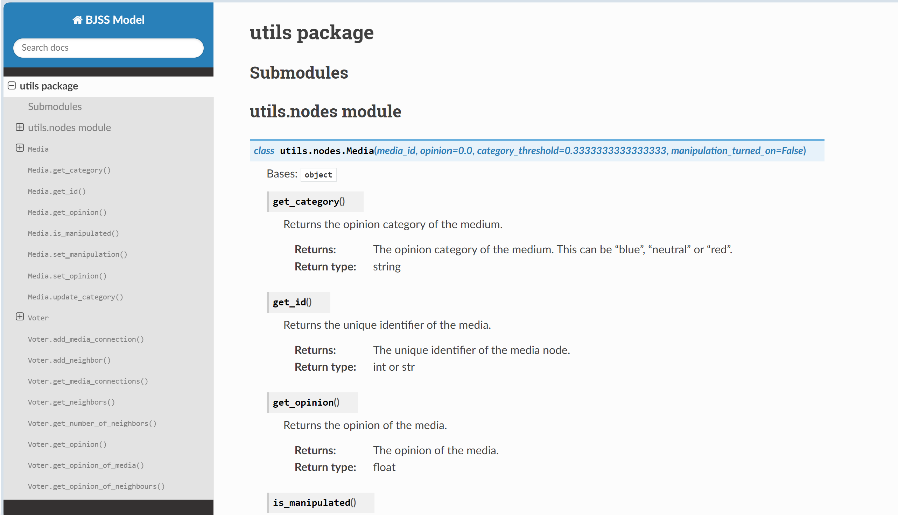

# complex_social_systems

Welcome to the GitHub of Team BJSS-Model

Please read all of the readme before diving into our code, it will save you some time.

We used [numpy doc style](https://numpydoc.readthedocs.io/en/latest/format.html) for our code. This also allow for automatic documentation using sphinx.

The documentation of our project can be found in the [docs](docs) folder. More instructions can be found there.
It can be opened with your favorite browser and looks something like this:

## CI Status:

Flake8 check:

## Some important information for you

The most important file is [main.py](main.py). This is where the main loop of our programm is located. In this file, many functions and classes are used that are defined in the [utils](utils) folder. In particular, we have:

- nodes.py which defines the classes for voter and media nodes
- network.py which generates the network, and defines processes on the network
- measure.py defines functions to calculate important quantities and also to save them
- visualization.py offers tools visualize these quantities

Furthermore there are is folder called [networks](networks), which contains precalculated networks, which avoids the necessesity to calculate the initial network each time from scratch.

[calibration.py](calibration.py) was used to perform the calibration, the results can be found in the [calibration](calibrations) folder.

The files named experiment are scripts that allow for the parallel execution of the main file for different input parameters, this allows for a faster execution.

